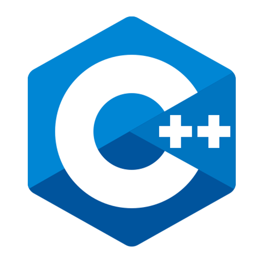
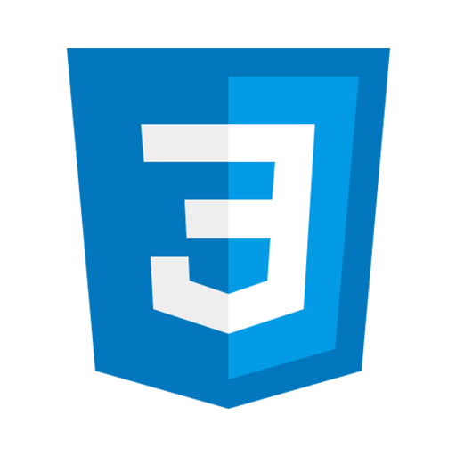
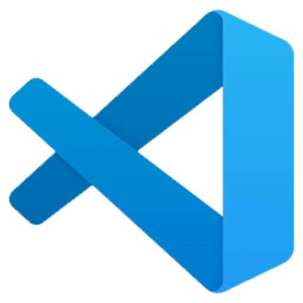

  

# Hi there, I'm NIKHIL RAJPUT - aka [nixrajput][portfolio] 👋

  
 

## Personal Details

**I am a Software Engineer specialized in both front-end and back-end development across platforms.**

* Passionate about building and designing software that is user-friendly and easy to use.
* Proficient in Dart, JavaScript, and C++.
* Strong in design and integration of front-end and back-end technologies.
* Looking to collaborate with other open-source [GitHub][github] content creators.
* ***Ask me about*** - Flutter, React.js, and Node.js.
* ***Fun fact*** - I love to play and watch Cricket as well as Football.

## Work Profile

* **Full Stack Development Intern at Techox LLP.**
* **Web Development Intern at Career Corner Solution Pvt Ltd.**

## *Languages*

* **Dart**
* **JavaScript**
* **C++**
* **Python**

## *Web Technologies*

* **HTML5**
* **CSS**
* **Sass**

## *Frameworks*

* **Flutter**
* **React.js**
* **Node.js**
* **Next.js**

## *Databases*

* **MySQL**
* **PostgreSQL**
* **MongoDB**
* **SQLite**

## Other Skills

* **Firebase**
* **Git**
* **Ubuntu**
* **AWS**

## *Connect with me*

* 
* 
* 
* 
* 

## Languages and Tools

## Github Stats

[][me]
[][me]
[][me]

[github]: https://github.com
[me]: https://github.com/nixrajput
[portfolio]: https://nixrajput.nixlab.co.in
[website]: https://nixlab.co.in
[facebook]: https://facebook.com/nixrajput07
[twitter]: https://facebook.com/nixrajput07
[instagram]: https://instagram.com/nixrajput
[linkedin]: https://linkedin.com/in/nixrajput